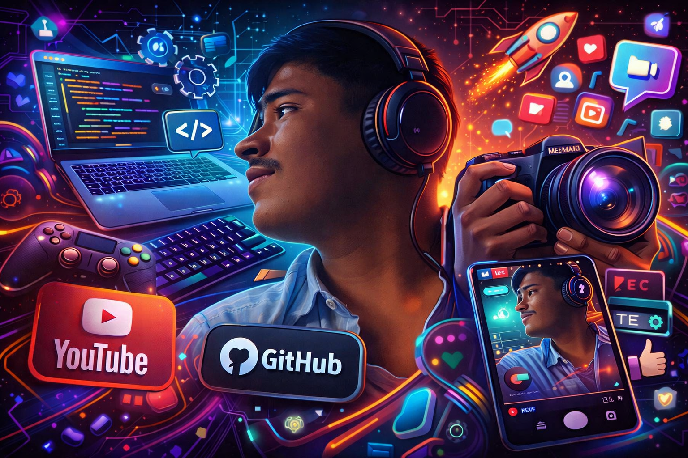

<!-- =======================  DARK • NEON • FUTURE • GAMER  ======================= -->

<p align="center">
  
</p>

<h1 align="center">⚡ DEV (SHUBH) ⚡</h1>

<p align="center">
  <b>💻 Computer Science Student • 🎮 Gamer • 🎥 Content Creator • 📸 Photographer</b><br>
  <i>Funny by nature — Serious when it matters • Always learning • Always building</i>
</p>

<br/>

<p align="center">
  
  
  
</p>

---

## 🔥 Circular Skill Power Charts

<p align="center">


</p>

<p align="center">


</p>

<p align="center">


</p>

<p align="center">
  <i>Leveling up every day — one line of code at a time 🚀</i>
</p>

---

## 📈 GitHub Activity Graph
<p align="center">
  
</p>

---

## 🧩 Tech Universe
<p align="center">

</p>

---

## ✨ About Me

👨‍🎓 **BSc Computer Science — SY (Second Year)**  
🧠 Passionate about **coding, creativity & problem solving**  
😄 **Funny in life — focused at work**  
🌌 Love building **aesthetic & futuristic projects**  
🚀 Always improving — one day at a time  

> Real name = **Shubh**  
> People call me = **Dev**

---

## 🛠 Tech Stack (Neon Mode)

```txt
Languages:
✔ Java   ✔ Python   ✔ JavaScript   ✔ C#   ✔ Dart   ✔ C / C++

Web:
✔ HTML   ✔ CSS   ✔ React (exploring)

Mobile:
✔ Flutter

Backend:
✔ Node.js   ✔ Firebase

Tools:
✔ Git & GitHub   ✔ VS Code   ✔ Postman   ✔ Figma   ✔ Firebase Console   ✔ Chrome DevTools


🌱 Currently Learning

🔥 Advanced Flutter UI / UX
🔥 Full-Stack Development
🔥 DSA & Competitive Problem Solving
🔥 Databases & Security
🔥 Real-world scalable systems

I believe in learning deeply — not just completing tutorials.

🎯 What I Like Building

✨ Clean • Minimal • Futuristic UIs
🛡 Secure & Efficient Apps
📱 Smooth & Aesthetic Mobile Apps
🎮 Fun & Interactive Projects
🤖 Smart Tools with AI Logic

🎮 Gamer Mode Activated

Yep — I’m a gamer too 😎

Games I enjoy playing:

🎮 GTA 5
⚔️ Mobile Legends
🏰 Clash of Clans (COC)
🔫 Call of Duty (CODM)
🎯 And many more…

Gaming taught me:

✔ Teamwork
✔ Focus
✔ Strategy
✔ Patience
✔ Never giving up

🎥 Content Creator • 📸 Photographer

🎥 I enjoy creating & editing content
📸 I love capturing moments & stories
🎨 Creativity + Tech = My happy place

🌌 Neon lights • 🎧 Lo-Fi music • 💻 Late-night coding — that’s the vibe ✨

🚀 Upcoming Projects

🛸 Futuristic UI Apps
🤖 AI-Powered Tools
🔐 High-Security Applications
🎨 Ultra-Aesthetic Websites & Portfolios

🌐 Portfolio

🔗 Portfolio — Live Here:
👉 https://shubh74.github.io/shubh-portfolio/

```
## 📊 Neon GitHub Stats

<p align="center">
  
  
</p>

```txt

✔ Build — Break — Fix — Learn
✔ Stay consistent
✔ Improve 1% every day
✔ Let actions speak louder than words

🤝 Let’s Connect

💬 Open for:
• collaborations
• ideas
• tech & creativity discussions

```

## 💫 My Developer Philosophy

<p align="center">
  
</p>

<p align="center">
  <b>“The future belongs to the ones who never stop learning.”</b> 💜
</p>

<!-- ======================= END ======================= -->
---
```txt
## 🟣 About The Circular Skill Charts (Explanation — NOT part of README)
These charts are **SVG radial graphs**. They:

✔ render directly inside GitHub  
✔ are super-fast  
✔ don’t need hosting  
✔ look futuristic  

If you want, I can:

🎨 change colors  
⚡ set **custom % values** (example: Flutter 85%)  
🛸 add more skills  
🕹 add a **Gamer Rank badge**  
📸 add a **Photography gallery section**

Just send me your **skill percentages** and I’ll make matching neon charts ✨
